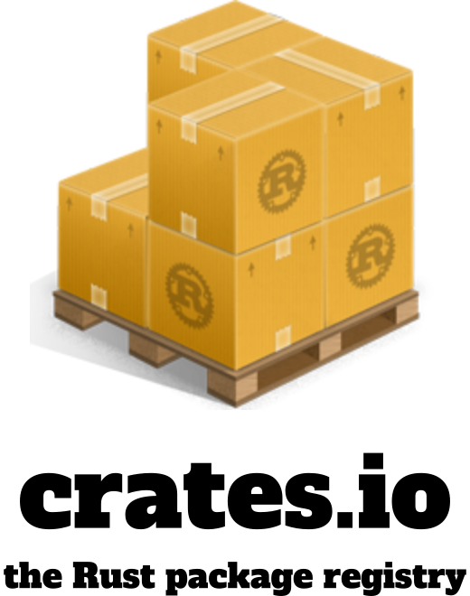

<picture>
  <source media="(prefers-color-scheme: dark)" srcset="./docs/readme-logo-dark.png">
  
</picture>

---

[Homepage][crates.io]
| [Usage Policy](https://crates.io/policies)
| [Security](https://crates.io/policies/security)
| [Status](https://status.crates.io/)
| [Contact](#️-contact)
| [Contributing](#️-contributing)

## 🦀 Overview

Welcome to the GitHub repository for [crates.io], the official package registry for the [Rust] programming language.

[crates.io] serves as a central registry for sharing "crates", which are packages or libraries written in [Rust] that you can use to enhance your projects. This repository contains the source code and infrastructure for the [crates.io] website, including both frontend and backend components.

This service is maintained for you by the [crates.io team], with support from the [Rust Foundation](https://rustfoundation.org/). File hosting is donated by [Amazon Web Services](https://aws.amazon.com/), with CDN services donated by [Fastly](https://fastly.com/).

## 🛠️ Contributing

We welcome contributions from the community! Whether you're fixing a bug, implementing a new feature, or improving documentation, your contributions help make [crates.io] better for everyone.

[crates.io] is built with [Rust] for the backend services. More specifically, the [axum] web framework and [diesel] for database access, with a [custom-built background worker system](./crates/crates_io_worker). The frontend is an [Ember.js] application written in JavaScript.

Please review our [contribution guidelines](./docs/CONTRIBUTING.md) before submitting your pull request. The same document also contains instructions on how to set up a local development environment.

## 🪲 Issue Tracker

If you encounter any bugs or have technical issues with [crates.io], please feel free to open an issue in our [issue tracker](https://github.com/rust-lang/crates.io/issues). Our team will review and address these as fast as we can.

For feature suggestions, enhancements, or general discussions about [crates.io], we encourage you to utilize [GitHub Discussions] instead. Visit the [Discussions tab][GitHub Discussions] to engage with the community, share your ideas, and participate in ongoing conversations. Your input is valuable in shaping the future of [crates.io], and we look forward to hearing your thoughts!

## ☎️ Contact

For any questions or inquiries about [crates.io], feel free to reach out to us via:

- **Zulip:** [#t-crates-io](https://rust-lang.zulipchat.com/#narrow/stream/318791-t-crates-io/)
- **Email:** [help@crates.io](mailto:help@crates.io)
- **GitHub Discussions:** [rust-lang/crates.io][GitHub Discussions]

We're here to help and eager to hear from you!

## 🤗 Code of Conduct

Respect and inclusivity are core values of the [Rust] community. Our [Code of Conduct] outlines the standards of behavior expected from all participants. By adhering to these guidelines, we aim to create a welcoming space where individuals from diverse backgrounds can collaborate and learn from one another. We appreciate your commitment to upholding these principles and fostering a positive community atmosphere.

If you have a Code of Conduct concern, please contact the moderators using the links in the [Code of Conduct].

## ⚖️ License

Licensed under either of these:

- Apache License, Version 2.0, ([LICENSE-APACHE](./LICENSE-APACHE) or https://www.apache.org/licenses/LICENSE-2.0)
- MIT license ([LICENSE-MIT](./LICENSE-MIT) or https://opensource.org/licenses/MIT)

[crates.io]: https://crates.io/
[Rust]: https://www.rust-lang.org/
[crates.io team]: https://www.rust-lang.org/governance/teams/crates-io
[Code of Conduct]: https://www.rust-lang.org/policies/code-of-conduct
[GitHub Discussions]: https://github.com/rust-lang/crates.io/discussions
[axum]: https://crates.io/crates/axum
[diesel]: https://crates.io/crates/diesel
[Ember.js]: https://emberjs.com/
