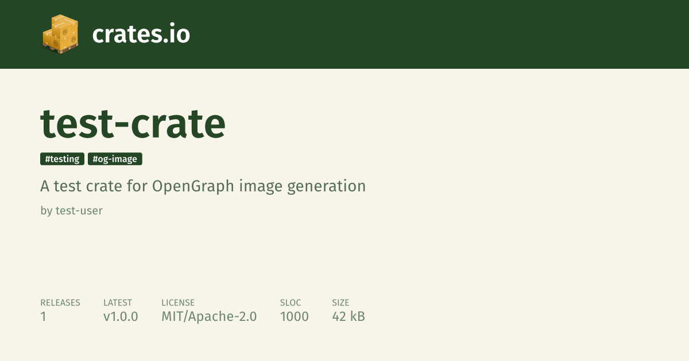

# crates_io_og_image

A Rust crate for generating Open Graph images for crates.io packages.



## Overview

`crates_io_og_image` is a specialized library for generating visually appealing Open Graph images for Rust crates. These images are designed to be displayed when crates.io links are shared on social media platforms, providing rich visual context about the crate including its name, description, authors, and key metrics.

The generated images include:

- Crate name and description
- Tags/keywords
- Author information with avatars (when available)
- Key metrics (releases, latest version, license, lines of code, size)
- Consistent crates.io branding

## Requirements

- The [Typst](https://typst.app/) CLI must be installed and available in your `PATH`

## Usage

### Basic Example

```rust
use crates_io_og_image::{OgImageData, OgImageGenerator, OgImageAuthorData, OgImageError};

#[tokio::main]
async fn main() -> Result<(), OgImageError> {
    // Create a generator instance
    let generator = OgImageGenerator::default();

    // Define the crate data
    let data = OgImageData {
        name: "example-crate",
        version: "1.2.3",
        description: Some("An example crate for testing OpenGraph image generation"),
        license: Some("MIT/Apache-2.0"),
        tags: &["example", "testing", "og-image"],
        authors: &[
            OgImageAuthorData::with_url(
                "Turbo87",
                "https://avatars.githubusercontent.com/u/141300",
            ),
        ],
        lines_of_code: Some(2000),
        crate_size: 75,
        releases: 5,
    };

    // Generate the image
    let temp_file = generator.generate(data).await?;

    // The temp_file contains the path to the generated PNG image
    println!("Image generated at: {}", temp_file.path().display());

    Ok(())
}
```

## Configuration

The path to the Typst CLI can be configured through the `TYPST_PATH` environment variables.

## Development

### Running Tests

```bash
cargo test
```

Note that some tests require Typst to be installed and will be skipped if it's not available.

### Example

The crate includes an example that demonstrates how to generate an image:

```bash
cargo run --example test_generator
```

This will generate a test image in the current directory. This will also test the avatar fetching functionality, which requires network access and isn't run as part of the automated tests.

## License

Licensed under either of:

- Apache License, Version 2.0 ([LICENSE-APACHE](LICENSE-APACHE) or <http://www.apache.org/licenses/LICENSE-2.0>)
- MIT license ([LICENSE-MIT](LICENSE-MIT) or <http://opensource.org/licenses/MIT>)

at your option.
